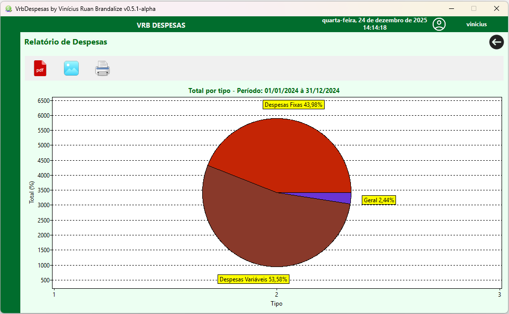
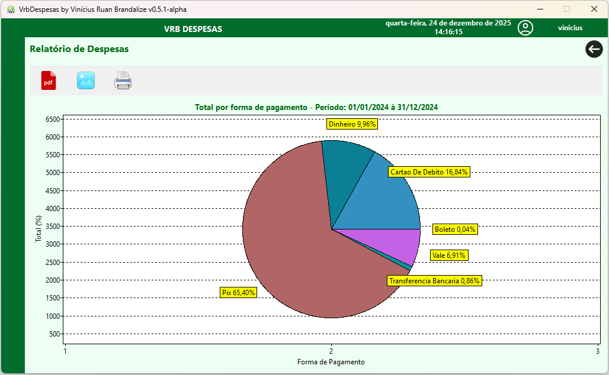
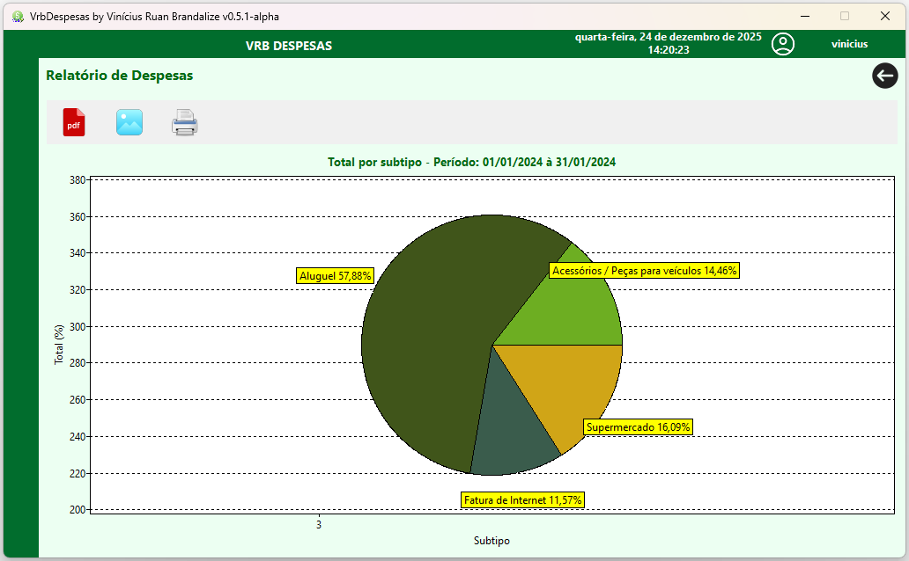

# VrbDespesas
 Software de controle e gerenciamento de despesas.
 
## Tecnologias utilizadas:
* <a href="https://www.lazarus-ide.org/"> Lazarus FPC (Versão 3.6).</a>
* <a href="https://jrsoftware.org/isinfo.php"> Inno Setup </a>
### Bancos de dados compatíveis:
* <a href="https://www.firebirdsql.org/"> Firebird 3.0 ou superior </a>
* <a href="https://www.postgresql.org/"> Postgresql </a>
* <a href="https://mariadb.org/"> MariaDB </a>
* <a href="https://www.mysql.com/"> MySQL </a>

## Arquitetura:
* Padrão MVC

## Dependências do projeto:
* <a href="https://github.com/viniciusruanbrandalize/VrbLibCep">VrbLibCep</a>
* <a href="https://github.com/alrieckert/lazarus/tree/master/components/lazreport">lazReport</a>
* <a href="https://github.com/alrieckert/lazarus/tree/master/components/lazreport/source/addons/pdfexport">lazReportPdfExport</a>
* <a href="https://github.com/viniciusruanbrandalize/libVrbBCrypt">libVrbBCrypt (.dll/.so)</a>
* <a href="https://github.com/viniciusruanbrandalize/libVrbCryptIni">libVrbCryptIni (.dll/.so)</a>

## Demonstração de Telas

  
  
  

## Instalação
Execute o arquivo vrbdespesas-setup-fb-x86.exe da versão mais recente.
Logo após, podes entrar com o usuário admin e a senha 123.

## Como Contribuir

Agradecemos seu interesse em contribuir para este projeto! Sua doação é importante!

### Doações

Se você gostaria de apoiar financeiramente o desenvolvimento deste projeto, você pode fazer uma doação através do QRCode via PIX:

