# VrbDespesas
 Software de controle e gerenciamento de despesas.
 
## Tecnologias utilizadas
* <a href="https://www.lazarus-ide.org/" target="_blank" target="_blank"> Lazarus FPC (Versão 4.6).</a>
* <a href="https://jrsoftware.org/isinfo.php" target="_blank"> Inno Setup </a>

### Bancos de dados compatíveis
* <a href="https://www.firebirdsql.org/" target="_blank"> Firebird 3.0 ou superior </a>
* <a href="https://www.postgresql.org/" target="_blank"> Postgresql 10 ou superior </a>
* <a href="https://mariadb.org/" target="_blank"> MariaDB </a>
* <a href="https://www.mysql.com/" target="_blank"> MySQL </a>
* <a href="https://sqlite.org/" target="_blank"> SQLite </a>

## Arquitetura
* Padrão MVC

## Dependências do projeto
* <a href="https://github.com/viniciusruanbrandalize/VrbLibCep" target="_blank">VrbLibCep</a>
* <a href="https://github.com/alrieckert/lazarus/tree/master/components/lazreport" target="_blank">lazReport</a>
* <a href="https://github.com/alrieckert/lazarus/tree/master/components/lazreport/source/addons/pdfexport" target="_blank">lazReportPdfExport</a>
* <a href="https://projetoacbr.com.br/" target="_blank">ACBr (Projeto ACBr)</a>
* <a href="https://github.com/viniciusruanbrandalize/libVrbBCrypt" target="_blank">libVrbBCrypt (.dll/.so)</a>
* <a href="https://github.com/viniciusruanbrandalize/libVrbCryptIni" target="_blank">libVrbCryptIni (.dll/.so)</a>

## Demonstração de telas

  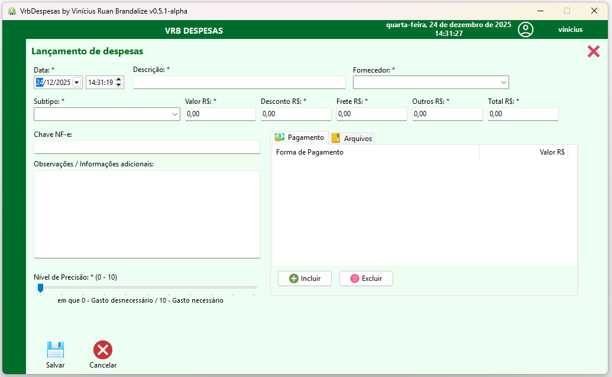
  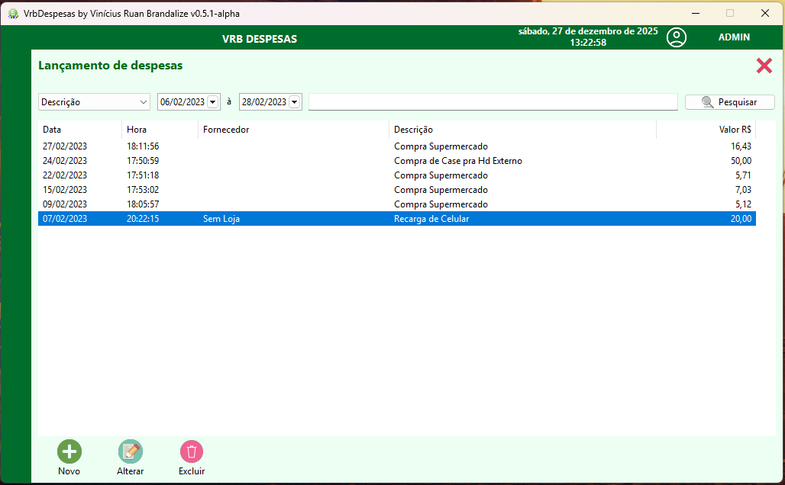
  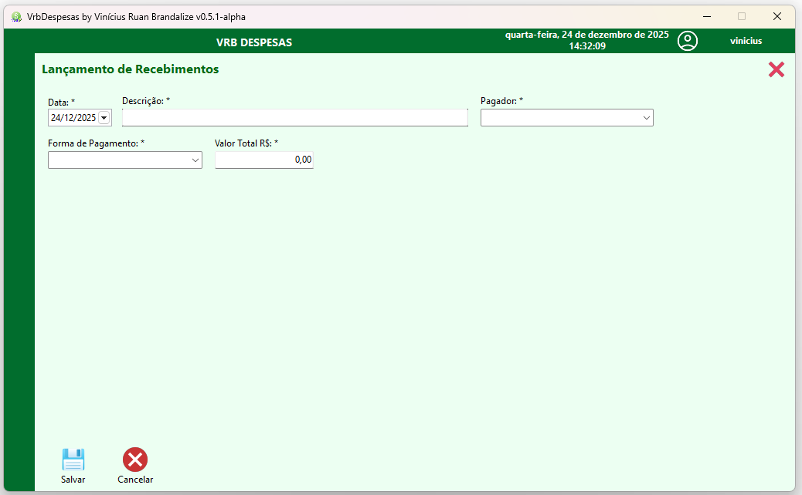
  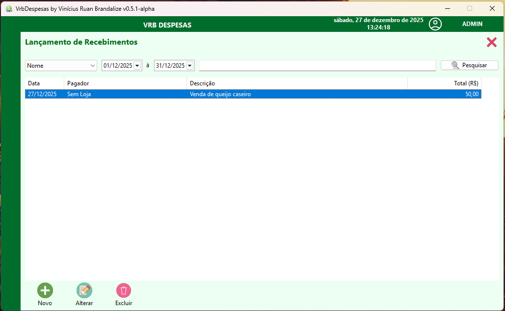

  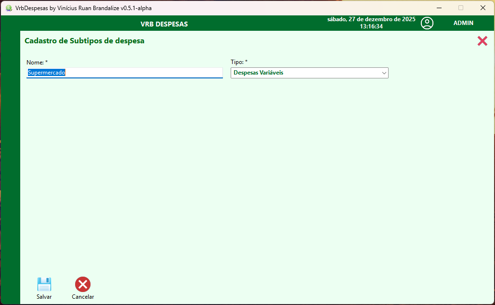
  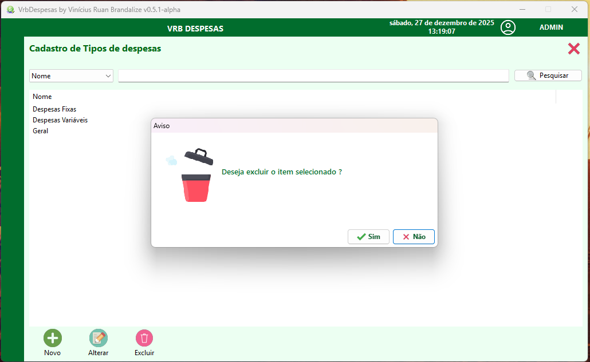
  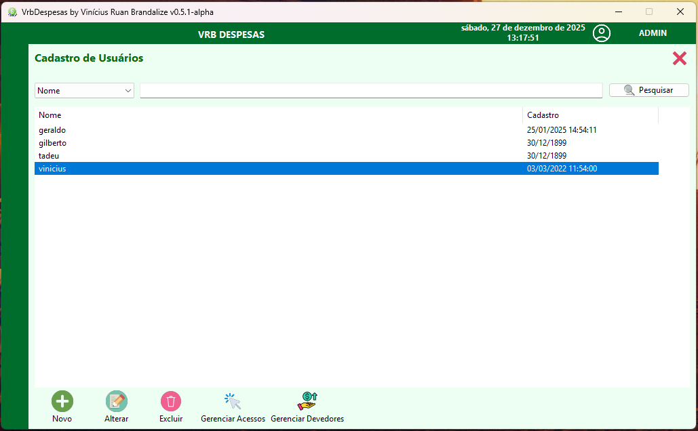
  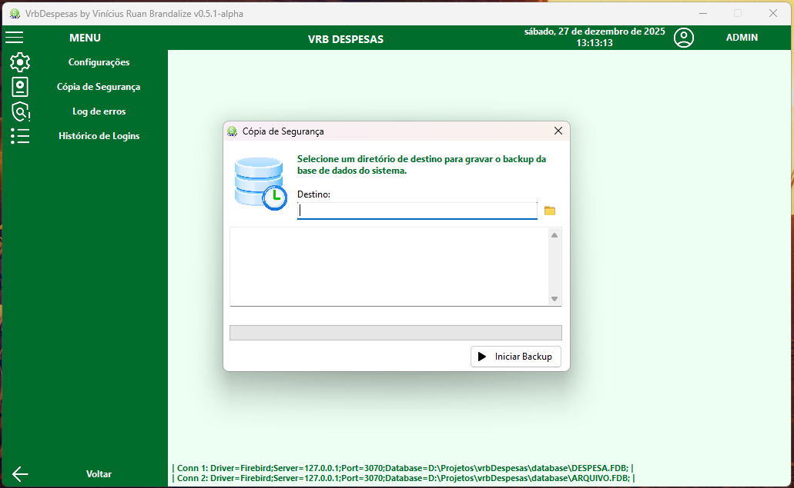

  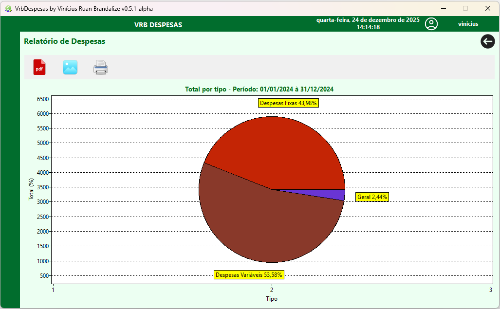
  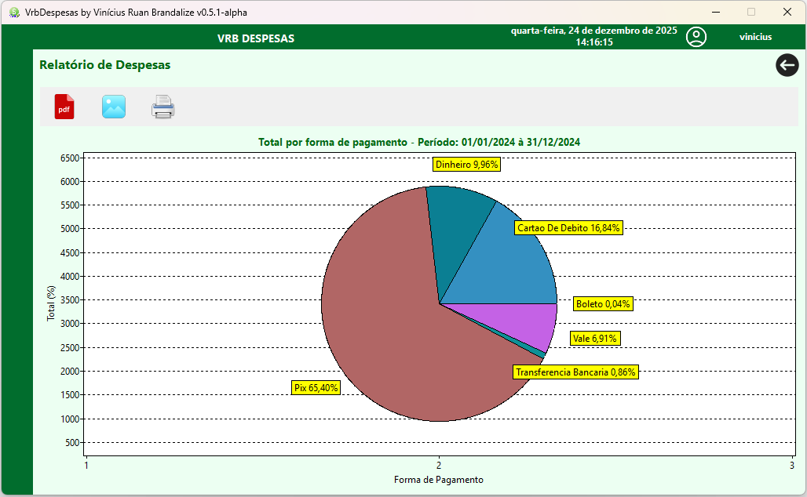
  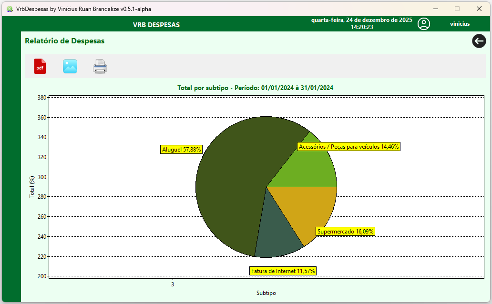
  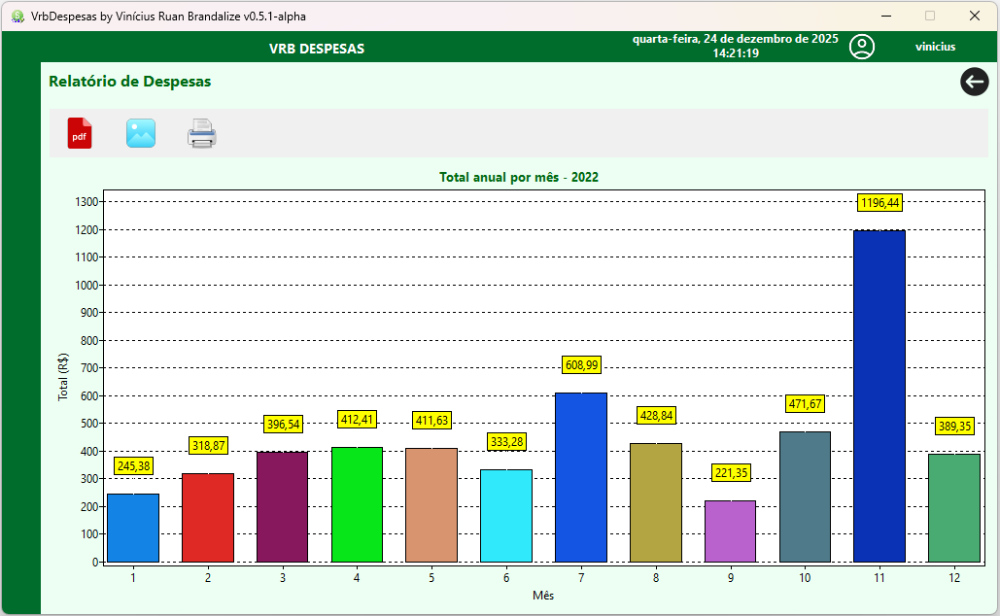

  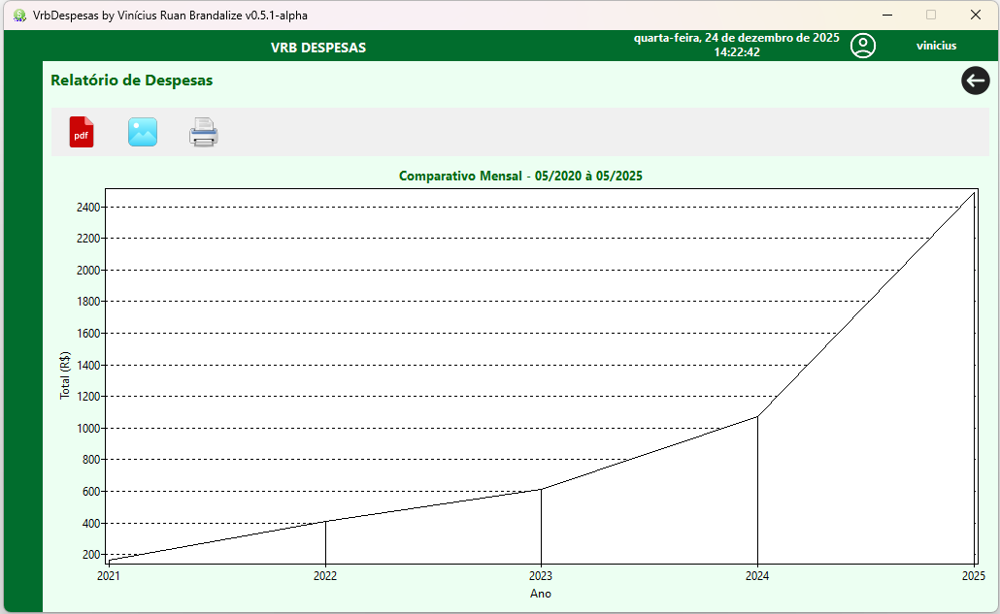
  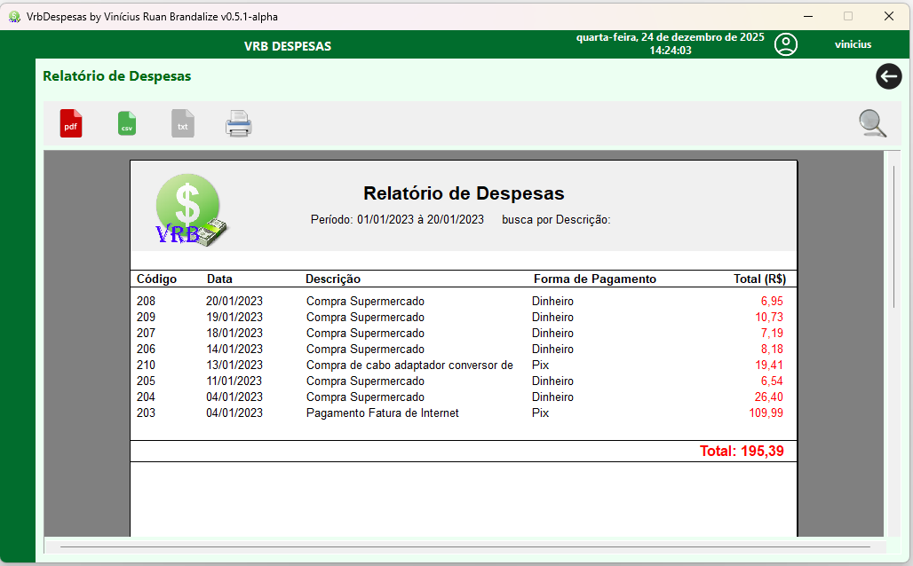
  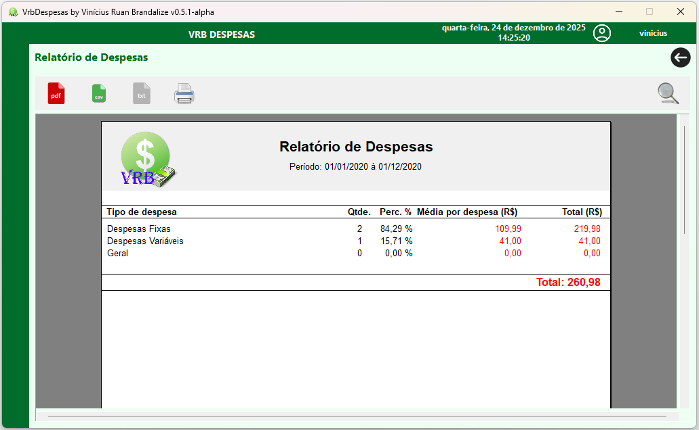
  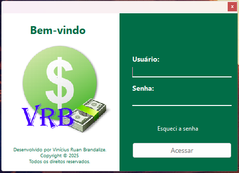

## Instalação (Somente para Windows)
Execute o arquivo vrbdespesas-setup-fb-x86.exe ou vrbdespesas-setup-sqlite3-x86.exe da versão mais recente.
Logo após, podes entrar com o usuário admin e a senha 123.
